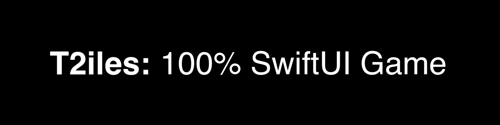

# swiftui-2048

### If you like the project, please give it a star ⭐ It will show the creator your appreciation and help others to discover the repo.

# ✍️ About 
🎲 **100%** `SwiftUI 3.0`, classic 2048 game. Supports `iOS`, `iPadOS` & `macOS`. 

# 📺 Demo 

## Gifs
Please wait while the `.gif` files are loading...

|  |  |
:-------------------------:|:-------------------------:
 | 
 |  
 |  

# 👻 Features
- Supports `iPhone`, `iPad` & `macOS`-enabled devices
- No graphical assets
- Minimum deployment target is `iOS 14.0` & `macOS 11.0`
- `Swift 5.7`
- Pure `SwiftUI 2.0` app
- Score & merge streak system: when multiple merges occur in a row - you got a score multiplier 😎
- Settings
- Interactive transitions
- Property list based persistence for `Settings`
- Portrait & landscape orientations support for `iPad`
- Can be easily extended to support `macOS`

# 👨‍💻 Author 
[Astemir Eleev](https://github.com/jVirus)

# 🔖 Licence
The project is availabe under the [MIT License]().
